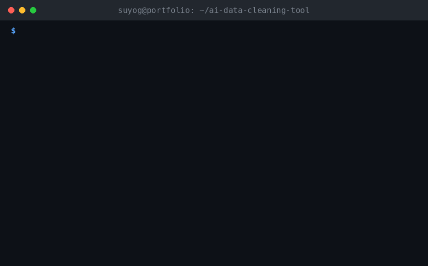

# ai-data-cleaner

[](https://github.com/shahsuyog1985/ai-data-cleaning-tool/actions/workflows/tests.yml)

[](LICENSE)

Turn disorganized files — unaligned PDF invoices, scrambled CSVs with no consistent
structure — into clean, categorized tables. An LLM (Claude) does the actual
interpretation: finding line items in messy text, reconstructing missing fields,
assigning a business category, and reporting a confidence score per row so a human
knows exactly what to double-check.



Built by [Suyog Shah](https://github.com/shahsuyog1985) — a marketing data analyst
who has spent a decade reconciling exactly this kind of messy vendor and campaign
data by hand (SQL/Redshift, Python, multi-touch attribution). This project automates
the first, most tedious step of that work: turning an unstructured export into a
table you can actually run analysis on.

## Why

Real-world exports are rarely clean. Invoices get sent as PDFs where nothing lines
up into real columns. Expense CSVs get hand-edited into ragged rows with inconsistent
delimiters. Traditional parsing (`pandas.read_csv`, regex, fixed-column PDF extraction)
breaks the moment the layout deviates from what it expects:

```text
>>> pd.read_csv("sample_data/scrambled_expenses.csv")
ERROR: Error tokenizing data. C error: Expected 5 fields in line 8, saw 6
```

This project takes the opposite approach: extract the raw text with no assumptions
about structure, then let an LLM do what a human would do with a messy printout —
read it, figure out what each line means, and reconstruct a clean table.

## How it works

```text
messy file (.pdf / .csv / .tsv / .txt)
        │
        ▼
  extractors.py        — pulls raw text only, no structure assumed
        │
        ▼
  ai_parser.py          — Claude (tool-use / forced function call) turns raw text into
        │                  structured line items: description, qty, unit price, total,
        │                  category, confidence, and notes on anything ambiguous
        ▼
  cleaner.py            — assembles a pandas DataFrame, flags low-confidence rows,
        │                  totals spend by category
        ▼
  cleaned CSV / XLSX + a console summary
```

The AI is called through Anthropic's **tool use** feature with a strict JSON schema
and a forced tool choice, not asked to "please respond in JSON" — so output is always
structurally valid, never a markdown-fenced blob that needs regex-scraping.

## Quickstart

```bash
git clone <this-repo>
cd ai-data-cleaning-tool
pip install -r requirements.txt
```

**See it work with no API key** — replays a cached real output from the bundled
"nightmare" sample files:

```bash
python -m ai_data_cleaner.cli demo --which invoice
python -m ai_data_cleaner.cli demo --which csv
```

**Run it for real** on your own file (or the same samples, live):

```bash
cp .env.example .env        # add your ANTHROPIC_API_KEY
python -m ai_data_cleaner.cli clean sample_data/nightmare_invoice.pdf
python -m ai_data_cleaner.cli clean path/to/your/messy_export.csv -o cleaned.xlsx
```

Sample console output:

```text
Reading sample_data/nightmare_invoice.pdf ...
Sending to AI for parsing (1,842 chars extracted) ...
Wrote 10 rows to output/nightmare_invoice.csv

Summary
  Document type:       invoice
  Line items found:    10
  Overall confidence:  89%
  Totals by category:
    Marketing & Advertising      $17,474.33
    Professional Services        $1,420.00
    Software & Subscriptions     $434.92
    Shipping & Freight           $88.40
    Meals & Entertainment        $41.16
  Issues noted by the AI:
    - Subtotal, tax, and TOTAL DUE summary rows were excluded from line items...
```

## Confidence scores and the review workflow

Every row gets a 0–1 confidence score and, when something was ambiguous or guessed,
a `notes` explanation — the point is that this is a *reviewable* pipeline, not a
black box. Anything under 60% confidence is flagged `needs_review = True` in the
output table so a human can scan just those rows instead of re-checking everything.

From the scrambled-expenses demo, for example, one row comes back at 45% confidence:

| description | total | confidence | notes |
|---|---|---|---|
| Parking garage (receipt lost, estimated) | 20.00 | 0.45 | Amount is a self-reported estimate ('~20') because the receipt was lost; not an exact figure. |

## CLI reference

```text
ai-data-clean clean INPUT_PATH [OPTIONS]

  -o, --output PATH         Output file (.csv or .xlsx). Defaults to output/<name>.csv
  --categories TEXT         Comma-separated categories, or a path to a JSON list,
                             overriding the defaults in categories.py
  --model TEXT              Anthropic model id (default: claude-3-5-haiku-20241022)
  --api-key TEXT            Overrides $ANTHROPIC_API_KEY
  --save-cache               Also save the raw AI JSON response next to the output

ai-data-clean demo --which [invoice|csv] [-o PATH]
  Replays cached output for the bundled sample files. No API key required.
```

(If you installed with `pip install -e .`, use the `ai-data-clean` entry point
directly instead of `python -m ai_data_cleaner.cli`.)

## Customizing categories

Swap in your own taxonomy — e.g. marketing spend categories instead of general
business expenses — without touching any parsing logic:

```bash
python -m ai_data_cleaner.cli clean report.pdf --categories "Paid Search,Paid Social,Programmatic,Affiliate,Organic/SEO,Creative Production,Tools & Platforms,Other"
```

or pass `--categories categories.json` with a JSON array.

## Project layout

```text
ai_data_cleaner/
  extractors.py     # raw text extraction — PDF (pdfplumber) and CSV/TSV/TXT
  ai_parser.py       # Claude tool-use call, schema, retry logic
  categories.py      # default business expense taxonomy
  cleaner.py         # orchestration, DataFrame assembly, confidence flagging
  cli.py             # click-based CLI (clean, demo)
sample_data/
  nightmare_invoice.pdf       # generated messy invoice, no real table structure
  scrambled_expenses.csv      # ragged CSV, inconsistent delimiters/columns
  demo_cache/*.json           # cached real AI outputs for `demo` mode
scripts/generate_sample_pdf.py  # regenerates the sample invoice
tests/                          # pytest suite, AI calls fully mocked
```

## Testing

```bash
pytest -q
```

All 16 tests run offline — the Anthropic client is mocked in `test_ai_parser.py`,
so the suite never makes a real API call or costs money to run in CI.

## Limitations & possible extensions

- Single-call parsing is capped at ~60k input characters to stay well within model
  context; a genuinely huge document would need to be chunked (e.g. by PDF page) and
  the results merged — a natural next step, not yet implemented.
- No OCR: a scanned (image-only) PDF won't extract text via `pdfplumber`. Adding an
  OCR fallback (e.g. `pytesseract`) for image-based PDFs is a natural extension.
- Currently Anthropic-only; the parsing prompt and JSON schema are provider-agnostic
  enough that an OpenAI/function-calling backend could be added behind the same
  `parse_document()` interface.
- Categorization uses a fixed taxonomy per run; a fuzzy-matching pass against
  historical categorizations (few-shot examples) could improve consistency across
  many files from the same source.

## License

MIT — see [LICENSE](LICENSE).
